包含 Java 版和基岩版，一步步教你如何与好友联机！

<!--more-->

# Java 版

Java 版联机**强烈推荐**安装 [LAN World Plug-n-Play (mcwifipnp)](https://modrinth.com/mod/mcwifipnp)

安装该 Mod 后，你可以方便地设置：

- **端口号**
- **最大玩家数**
- 服务器信息（MOTD）
- **白名单**
- **正版验证**
- **PVP 开关** 等

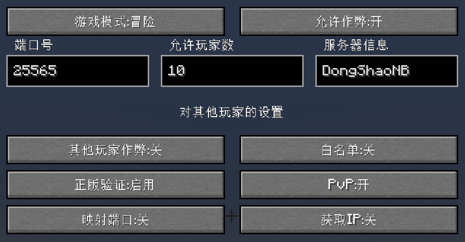

**建议使用 25565 作为端口号**，这也是我的世界服务端的默认端口  
**Java 版教程默认使用 25565 端口号 且 已开放局域网世界进行演示**

## 白名单设置

常用白名单命令如下：

- 添加白名单玩家：`/whitelist add <玩家名>`
- 删除白名单玩家：`/whitelist remove <玩家名>`
- 查看白名单内玩家：`/whitelist list`
- 开启白名单：`/whitelist on`
- 关闭白名单：`/whitelist off`

> [!WARNING]
> 白名单中**默认不包含自己**  
> 如果在局域网设置中开启了白名单，然后使用命令 `/whitelist off` 再 `/whitelist on`，而你自己不在白名单内，就会被服务器**直接踢出**！

## 正版验证设置

- 如果所有玩家都使用正版账号游玩，选择「`启用`」即可
- 如果有离线玩家，或全部为离线玩家，选择「`禁用 + 修复 UUID`」

---

## 联机方式概览

Java 版联机的大致方式可以分为两类：

1. **暴露端口**：让其他玩家直接访问你电脑上的 25565 端口
2. **虚拟组网**：让所有玩家处在同一个「虚拟局域网」中

下面按方式展开说明

---

## 暴露端口

暴露端口的核心思路是：**让外网玩家能访问你电脑上的 25565 端口**

常见做法有：

- 公网 IPv4 直连
- 公网 IPv6 直连
- 内网穿透（例如 FRP）

### 公网直连

公网直连分为 IPv4 与 IPv6  
优点是**延迟最低、路径最短**；缺点是**门槛较高**（需要公网 IP、路由器设置等）

#### 使用公网 IPv4

普通家庭宽带通常**没有**公网 IPv4，需要向运营商单独申请  
现在很多地区运营商已经不再免费提供公网 IPv4，或需要额外收费

**如何判断自己是否有公网 IPv4：**

1. 打开路由器管理页面并登录
2. 找到 WAN 口信息，记下 WAN 口 IP
3. 打开 [IP.cn](https://ip.cn/)，查看网页上显示的 IP
4. 如果 [IP.cn](https://ip.cn/) 显示的 IP 与路由器 WAN 口 IP 一致，说明你有公网 IPv4，**此时网页显示的 IP 就是你的公网 IPv4**

> 如果你没有公网 IPv4，则**无法使用 IPv4 公网直连**

**如果你有公网 IPv4：**

1. 在游戏内开启「对局域网开放」
2. 打开路由器管理页面并登录
3. 找到「端口映射 / 端口转发」功能
4. 新增一条规则：
   - 主机：选择你当前电脑的 IP 或 MAC
   - 内部端口：`25565`
   - 外部端口：`25565`
5. 保存/应用设置

现在，你的朋友只需要在多人游戏里填入你的公网 IPv4，即可加入你的世界

> [!NOTE]
> 完整的 IP 地址通常是「IP + 端口号」，例如：`114.51.41.91:9181`  
> 但因为 **25565 是我的世界默认端口**，所以当端口号使用 25565 时，可以只填 `114.51.41.91`，不填端口号也能连接到 25565

#### 使用公网 IPv6

IPv6 是互联网协议的第 6 个版本，主要为了解决 IPv4 地址枯竭问题  
IPv6 的地址数量极其庞大，号称能够给地球上每一粒沙子都分配一个独立地址

在大多数地区，运营商默认会给家庭宽带分配 IPv6 地址

> [!IMPORTANT]
> 使用 IPv6 联机**需要所有玩家都拥有** IPv6 地址！

**如何判断自己是否有可用的公网 IPv6：**

1. 打开 http://6.ipw.cn/
2. 如果页面能正常打开，并且显示了一个 IPv6 地址，说明你当前网络已经具备 IPv6 访问能力，**网页中显示的 IP 就是你的公网 IPv6**
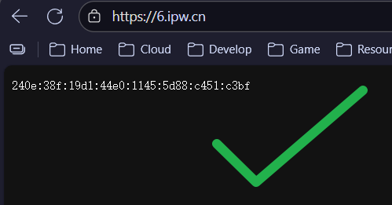


如果你**无法访问**这个网站，则**无法使用 IPv6 公网直连**

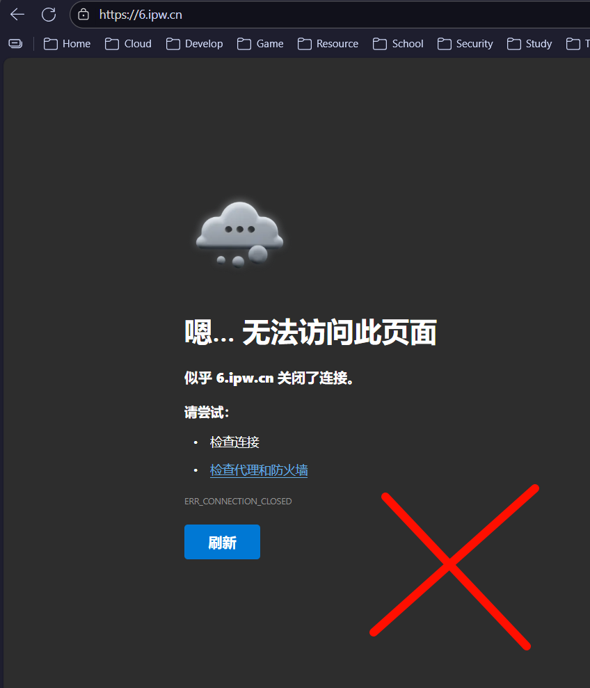

**如果你有公网 IPv6：**

- 直接在游戏内开启「对局域网开放」即可，路由器通常不需要额外设置端口映射

此时，你的朋友只需要在多人游戏界面中填入你的公网 IPv6 地址，就可以加入你的世界

> [!NOTE]
> IPv6 地址在填写时需要使用中括号包裹  
> 比如你的 IPv6 是 `2001:0db6:abce:1235:5679:9abc:def0:1111`，  
> 那么在多人游戏中，应输入：  
> `[2001:0db6:abce:1235:5679:9abc:def0:1111]`  
> 如果还要指定端口号，需要在 `]` 后加 `:` 和端口号，例如：  
> `[2001:0db6:abce:1235:5679:9abc:def0:1111]:25565`

---

### FRP 内网穿透

FRP 是一个内网穿透工具，无公网 IP 的客户端先连接到一台有公网 IP 的服务器，在这台服务器上运行 FRP 服务端  
之后所有对服务器端口的访问都会由服务器转发到客户端，本地端口的流量也会通过服务器转发到外网，从而实现内网穿透  

从 FRP 的原理可以得知，我们似乎需要一台有公网 IP 的服务器？  
实际上有很多 FRP 服务商提供**免费服务**（但有限速和一定的流量），比如最知名的[樱花 FRP (SakuraFrp)](https://www.natfrp.com/)

#### FRP 服务商

以[樱花 FRP](https://www.natfrp.com/) 为例，首先前往[官网](https://www.natfrp.com/)注册登录，进入管理面板  

顶部选择「`服务 - 软件下载`」

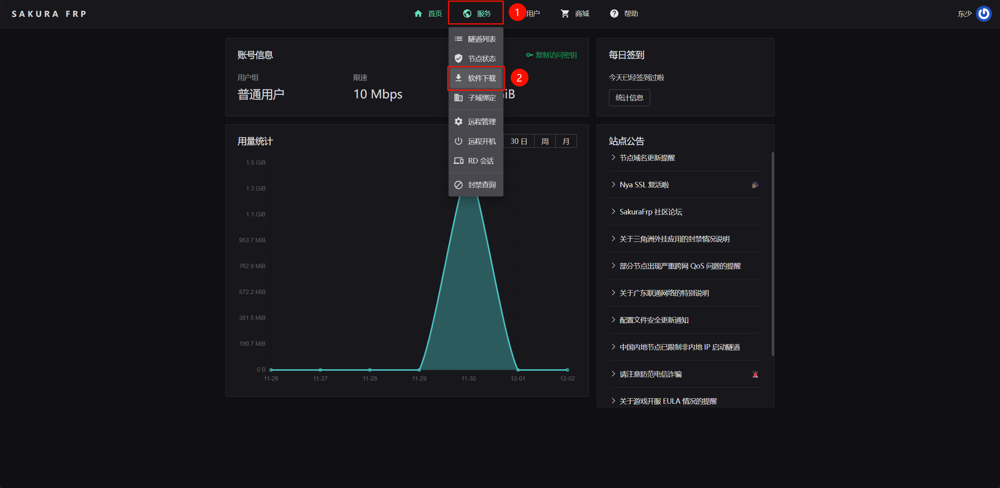

然后下载对应自己系统的启动器，安装  

> [!CAUTION]
> 如果你使用过工具关闭 Windows Defender，**一定要取消勾选**「`添加 Windows Defender 排除项`」！否则安装程序会自动修复重新启用 Windows Defender！

安装选项没特殊要求保持默认即可，勾选「`创建桌面快捷方式`」，完成安装  

安装完成后启动「`SakuraFrp 启动器`」，需要填入账户的访问密钥

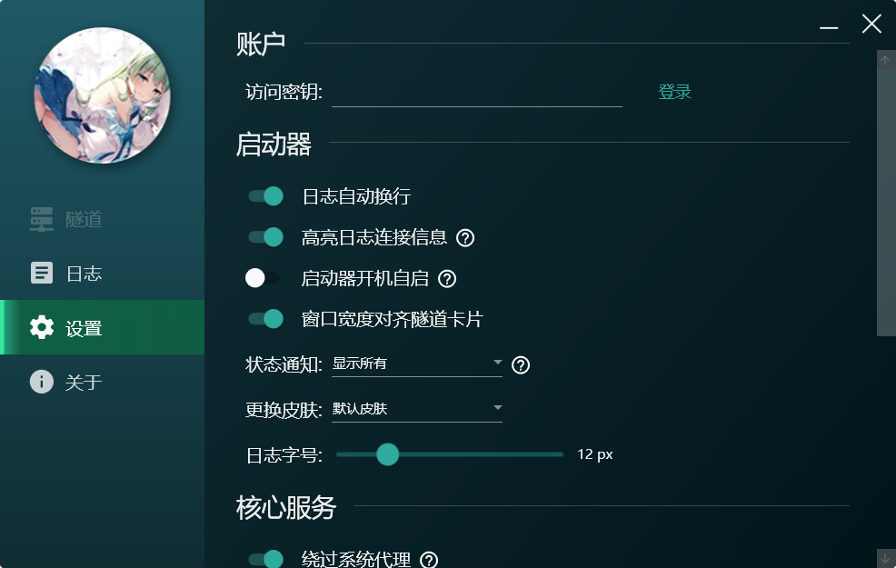

回到[樱花 FRP 管理面板](https://www.natfrp.com/user/)，点击复制访问密钥

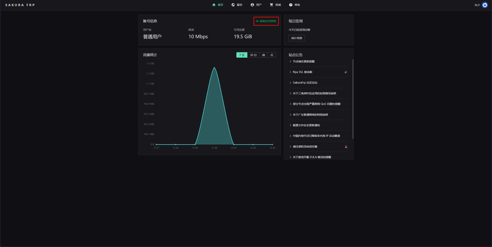

粘贴在启动器的访问密钥处，点击「`登录`」

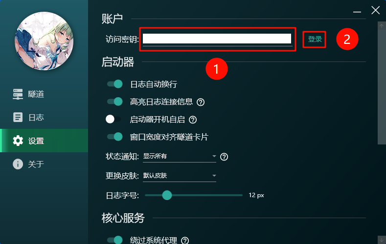

登录成功后，点击左侧的「`隧道`」，点击「`加号`」创建新隧道

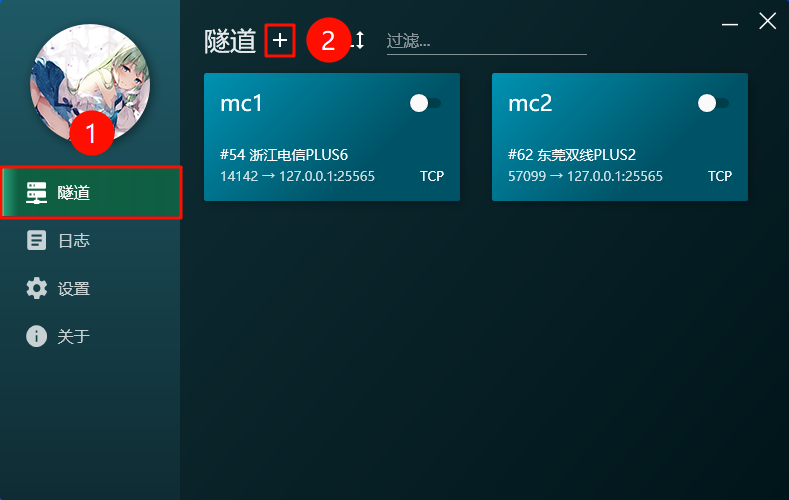

根据「`地理位置(所有玩家平均最近) + 节点情况(高带宽低负载) + 运营商(相同运营商)`」选择节点

> [!NOTE]
> Java 版联机使用 TCP 协议，禁用 UDP 协议的节点也可以使用

选择完节点后，点击「`TCP 隧道`」，「`隧道名`」任意填写，「`本地端口`」填写**开放局域网时的端口**（本文使用 25565），其他留空即可，确认无误后，点击创建

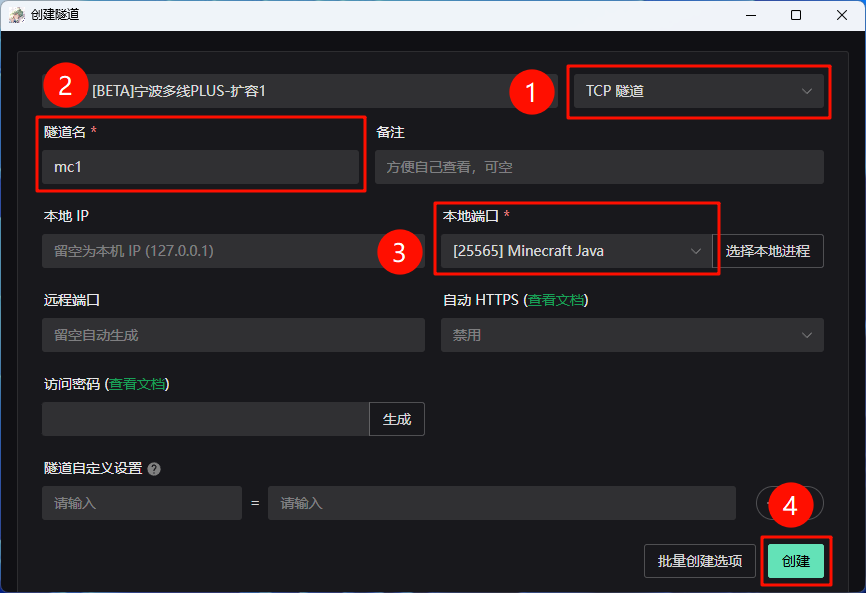

随后打开隧道右侧的开关，点击左侧的「`日志`」  
**如果一切正常**，你可以在日志中看到 IP

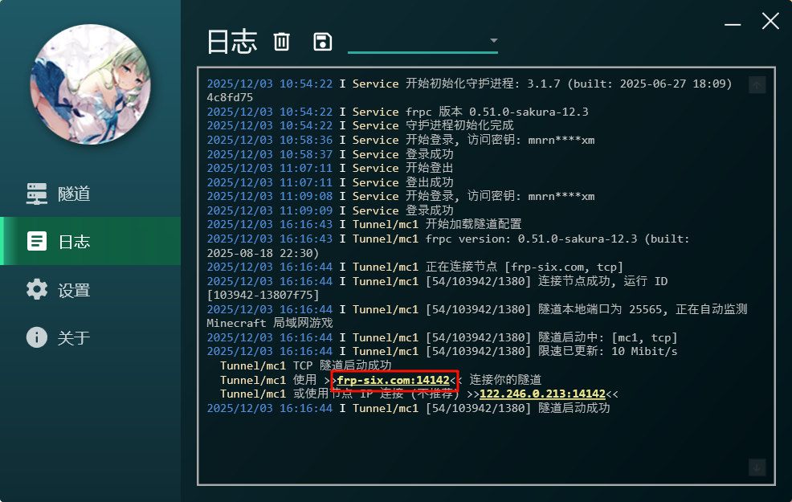

把 IP 发给你的朋友，开始游玩吧~

> 其他 FRP 服务商大差不差，核心地方就是选择 **TCP 隧道**和填写**正确的本地端口**

#### 自搭建 FRP 服务端（Linux + Docker）

> [!IMPORTANT]
> 自搭建需要你有一定的 Linux 基础和 Docker 基础

既然是自搭建服务端，那我们得有一个**有公网IP的服务器**  
  
**在寻找云服务商**？**对当前使用的服务器不满**？来看看新一代云服务提供商 [雨云](https://www.rainyun.com/panel_?s=blog)  
**1元试用1天，7天无理由退款，资质齐全，放心使用高性价比云服务**，快来[体验](https://www.rainyun.com/panel_?s=blog)吧！  
  
该部分使用「`雨云 广东深圳地区 最低配机器`」，「`无限流量`」， 「`RockyLinux 9`」 系统进行演示

通过 SSH 连接到服务器  

切换软件源到中科大源

```bash
sudo sed -e 's|^mirrorlist=|#mirrorlist=|g' \
         -e 's|^#baseurl=http://dl.rockylinux.org/$contentdir|baseurl=https://mirrors.ustc.edu.cn/rocky|g' \
         -i.bak \
         /etc/yum.repos.d/rocky*.repo
```

更新缓存

```bash
sudo dnf makecache
```

更新软件包

```bash
sudo dnf update -y
```

添加 Docker 软件源

```bash
sudo dnf config-manager --add-repo https://download.docker.com/linux/centos/docker-ce.repo
```

切换 Docker 软件源为清华源

```bash
sudo sed -i 's+https://download.docker.com+https://mirrors.tuna.tsinghua.edu.cn/docker-ce+' /etc/yum.repos.d/docker-ce.repo
```

安装 Docker

```bash
sudo dnf install docker-ce docker-ce-cli containerd.io docker-buildx-plugin docker-compose-plugin -y
```

启动 Docker 并设置开机自启

```bash
sudo systemctl enable docker --now
```

创建 Docker 配置文件目录

```bash
sudo mkdir -p /etc/docker
```

修改 Docker Hub 镜像源

```bash
sudo tee /etc/docker/daemon.json > /dev/null << 'EOF'
{
  "registry-mirrors": [
    "https://docker.1ms.run",
    "https://docker.m.ixdev.cn",
    "https://hub.rat.dev",
    "https://dockerproxy.net",
    "https://hub1.nat.tf",
    "https://hub2.nat.tf",
    "https://hub3.nat.tf",
    "https://hub4.nat.tf",
    "https://docker.m.daocloud.io",
    "https://dockerproxy.cool"
  ]
}
EOF
```

重启 Docker 服务

```bash
sudo systemctl restart docker
```

创建 frp 配置文件目录

```bash
sudo mkdir -p /etc/frp
```

写入配置文件

```bash
sudo tee /etc/frp/frps.toml > /dev/null << 'EOF'
# 服务端监听端口
bindPort = 7000

# 认证方式
auth.method = "token"

# 认证 token（与 frpc 保持一致）
# 建议随机一个 30 位的密码填入
auth.token = "hlQGUUX32J*8u#XLl*OcV1ZMXBq8FN"
EOF
```

根据需求修改配置文件（**建议重新生成密码填入**）

```bash
sudo vi /etc/frp/frps.toml
```

> [!TIP]
> 进入编辑器后，先按「`I`」切换写入模式，再进行编辑  
> 编辑完成后，按「`ESC`」退出写入模式，输入「`:wq`」，回车保存退出

启动 frps 服务

```bash
docker run --restart=always --network host -d -v /etc/frp/frps.toml:/etc/frp/frps.toml --name frps snowdreamtech/frps
```

查看运行状态

```bash
docker ps
```

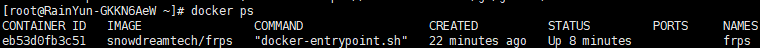

#### 自搭建 FRP 服务端（Windows / Windows Server）

首先，前往[GitHub Release](https://github.com/fatedier/frp/releases)下载**对应架构**的 Windows 版压缩包

> [!TIP]
> 多数电脑都是 amd64 架构，但也有部分（如骁龙 CPU）电脑是 arm64 架构

下载完成后解压，我们只需要「`frps.exe`」和「`frps.toml`」文件，可以在桌面创建「`frps`」文件夹放里面  

打开文件夹，编辑「`frps.toml`」文件，使用下面的配置覆盖原有的配置  

同时，根据需求修改配置文件（**建议重新生成密码填入**）  

```toml
# 服务端监听端口
bindPort = 7000

# 认证方式
auth.method = "token"

# 认证 token（与 frpc 保持一致）
# 建议随机一个 30 位的密码填入
auth.token = "hlQGUUX32J*8u#XLl*OcV1ZMXBq8FN"
```

修改完成后，在文件夹空白处右键，选择「`在终端中打开`」，输入以下命令启动 frps  

```shell
.\frps.exe -c .\frps.toml
```

终端输出「`frps started successfully`」即可

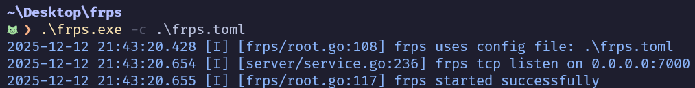

两种方式部署服务端已完成，如果后面客户端无法连接到服务端，**请排查服务器防火墙与云服务商防火墙/安全组问题**

#### 连接 FRP 服务端

首先，前往 [GitHub Release](https://github.com/fatedier/frp/releases)下载**对应架构和系统**压缩包  

> [!TIP]
> 多数电脑都是 amd64 架构，但也有部分（如骁龙 CPU）电脑是 arm64 架构

**下面以 Windows 为例**  

下载完成后解压，我们只需要「`frpc.exe`」和「`frpc.toml`」文件，可以在桌面创建「`frpc`」文件夹放里面  

打开文件夹，编辑「`frpc.toml`」文件，使用下面的配置覆盖原有的配置  

其中，「`serverAddr`」为服务器 IP，「`serverPort`」为服务端监听端口，「`auth.token`」为服务端认证 token  
「`proxies`」里的「`localPort`」为本地端口，也就是在开放局域网时填写的端口，「`remotePort`」为远程端口，即远程服务器端口，你的朋友通过这个端口进入

```toml
# 服务端的 IP
serverAddr = "frps.dsnb.cc"

# 服务端的端口
serverPort = 7000

# 认证方式
auth.method = "token"

# 认证 token（与 frps 保持一致）
auth.token = "hlQGUUX32J*8u#XLl*OcV1ZMXBq8FN"

[[proxies]]
name = "mcserver"
type = "tcp"
localIP = "127.0.0.1"
localPort = 25565
remotePort = 25565
```

如果要创建多个穿透，只需再添加「`proxies`」段并修改信息，「`name`」不能重复

```toml
# 服务端的 IP
serverAddr = "frps.dsnb.cc"

# 服务端的端口
serverPort = 7000

# 认证方式
auth.method = "token"

# 认证 token（与 frps 保持一致）
auth.token = "hlQGUUX32J*8u#XLl*OcV1ZMXBq8FN"

[[proxies]]
name = "mcserver"
type = "tcp"
localIP = "127.0.0.1"
localPort = 25565
remotePort = 25565

[[proxies]]
name = "mcserver2"
type = "tcp"
localIP = "127.0.0.1"
localPort = 25566
remotePort = 25566
```

修改完成后，在文件夹空白处右键，选择「`在终端中打开`」，输入以下命令启动 frpc  

```shell
.\frpc.exe -c .\frpc.toml
```

终端输出「`start proxy success`」即可

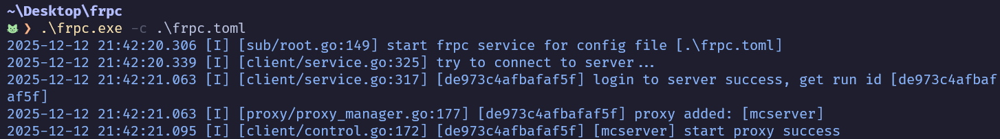

至此，FRP 客户端已连接到服务端，你的朋友可以使用服务器的 IP + 「`remotePort`」远程端口进入世界了

如果朋友无法连接，**请排查服务器防火墙与云服务商防火墙/安全组问题**

> [!TIP]
> 可以通过 [在线 TCP ping](https://www.itdog.cn/tcping) 检查端口是否开放，输入格式为「`IP:端口号`」，例如「`114.51.41.91:25565`」

---

## 虚拟组网

TODO

---

# 基岩版

TODO