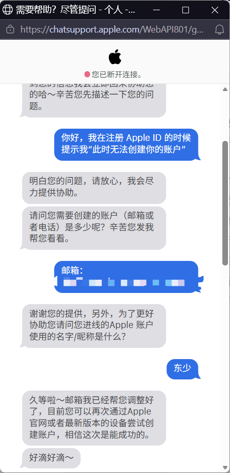

解决在注册苹果账号(Apple ID) 时提示 "此时无法创建你的账户"

<!--more-->

# 原因

无法注册的原因无非就是 Apple 认为你的操作异常，拦截了操作

# 解决方法

解决方法也十分简单，就是联系苹果客服（中国大陆客服也可以），可以通过在线联系，也可以通过电话联系

该方法**能够 100% 解决问题**，且已存在多年，截止到本文发出日期仍可使用。唯一缺点就是要在客服上班时间联系

在线联系：[https://getsupport.apple.com/products](https://getsupport.apple.com/products)

进入页面后，选择 `Apple 账户 -> 其他 Apple 账户主题 -> 创建 Apple 账户 -> 获取更多协助 -> 实时聊天`

页面/步骤可能会有变化，只要能连线客服就好，就算进错类型，客服也可以帮忙转线

中国大陆客服电话：`400-666-8800`

接入客服后，说明 `注册 Apple ID 的时候 提示"此时无法创建你的账户"`

客服会让你提供邮箱，告知注册时填写的邮箱即可，随后再次注册即可成功

聊天记录

 
